# UserStorage Project

The goal of this project is to create an easily configured distributed application that has open WCF API and communicates its state through the network.

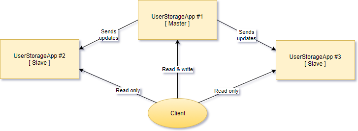

UserStorage service is a simple service that stores user records and provides an API for managing user records and searching. It is possible to run several instances of this service and share user records between them. The only instance that allows READ and WRITE operations is called MASTER NODE. The other instances allow only READ operations. Those are known as SLAVE NODES. The only one READ operation in API is SEARCH, and there are two WRITE operations - ADD and REMOVE. That means UserStorage service can operate in two modes - MASTER and SLAVE. Responsibilities of the service in MASTER mode includes spreading the changes to all services that operate in SLAVE mode.

In other words, MASTER NODE accepts READ (SEARCH) and WRITE (ADD/REMOVE) operations, changes its state, and sends an update to all SLAVES NODE that accepts only READ (SEARCH) operations. If a client sends WRITE request to a SLAVE NODE, the node replies with an error.

Described approach when MASTER NODE owns original data and other SLAVE NODES have only the copy is known as [MASTER-SLAVE data replication](https://ruhighload.com/post/%D0%A0%D0%B5%D0%BF%D0%BB%D0%B8%D0%BA%D0%B0%D1%86%D0%B8%D1%8F+%D0%B4%D0%B0%D0%BD%D0%BD%D1%8B%D1%85). Possible solutions here are:
* MASTER NODE sends updates to all SLAVE NODES by himself.
* SLAVE NODES sends a request to MASTER NODE and MASTER replies with a bunch of updates.
* Other...

We recommend using the first approach, because we think that this solution is simpler that others.

Also, a MASTER NODE has a persistent storage for user record information when the application is not working. SLAVE NODES have only in-memory storage, and they do not save its state when they are not running. A persistent storage uses the file system to save user records when an application is shutting down and load them when it starts. A good question here is how to initialize the internal state of a SLAVE NODE when an application starts. The answer to this question is a part of the architectural design of this project.

A MASTER NODE sends updates to SLAVE NODES using TCP as a [transport channel](https://en.wikipedia.org/wiki/List_of_network_protocols_(OSI_model)#Layer_4_.28Transport_Layer.29) and [internet sockets](https://docs.microsoft.com/en-us/dotnet/api/system.net.sockets) as endpoints.

The one main thing about this project is that the final application should be configurable, and all application settings should be placed in App.config file. SLAVE NODE is the same application as a MASTER NODE except differences in application configuration file.


## Template

In the [UserStorage](UserStorage) folder you can find a solution template that you can use for building your own application. Let's take a look at the C# projects in the folder:

* [UserStorageApp](UserStorage/UserStorageApp) - a console application project with predefined [App.config](UserStorage/UserStorageApp/App.config). This project should not contain any service related code, only initialization and configuration logic. The configuration file has a custom section that is named _serviceConfiguration_. This section is for defining services configuration and settings. Visual Studio also provides IntelliSense support for this section because the section schema is defined in [ServiceConfiguration.xsd](UserStorage/UserStorageApp/ServiceConfiguration.xsd) file. 
* [UserStorageServices](UserStorage/UserStorageServices) - a class library project for all service related code.
* [UserStorageServices.Tests](UserStorage/UserStorageServices.Tests) - a class library project with all unit tests for service related behavior.
* [ServiceConfigurationSection](UserStorage/ServiceConfigurationSection) - a class library project that stores classes for handling _serviceConfiguration_ custom section in App.config.
* [UserStorage.Diagnostics](UserStorage/UserStorage.Diagnostics) - a class library project that stores WCF contracts for the special DiagnosticsService that monitors current state of other services.
* [UserStorageMonitor](UserStorage/UserStorageMonitor) - a console application project that access DiagnosticsService and prints service state.

UserStorage service operates over an entity that describes a user and has relevant name - [User class](UserStorage/UserStorageServices/User.cs) in UserStorageServices project. This class is pretty simple, and has FirstName, LastName and Age fields only.

```cs
class User
{
	public string FirstName { get; set; }

	public string LastName { get; set; }

	public int Age { get; set; }
}
```

UserStorageServices project also has [UserStorageService class](UserStorage/UserStorageServices/UserStorageService.cs) that is a template for UserStorage service you will be working with.

It is worth mentioning that this code is only the initial template - you are allowed not only to add new code, but also the code refactor it in a way you like.

We encourage you to practice TDD and actively use Git during this exersise. Here are some principles that might be useful for you:
* [Test-First](http://www.extremeprogramming.org/rules/testfirst.html), ["Детали test-first, которых так не хватало"](https://habrahabr.ru/company/mailru/blog/274771/).
* [Red-Green-Refactor cycle](http://www.jamesshore.com/Blog/Red-Green-Refactor.html)
* [Do commit early and often](https://sethrobertson.github.io/GitBestPractices/#commit)
* [Branch-per-Feature](http://dymitruk.com/blog/2012/02/05/branch-per-feature/)


## Prepare

- [x] Create a new repository on github. Move all content of the master branch in this repository to your new repository.

- [x] Install [StyleCop](https://github.com/StyleCop/StyleCop) or [Visual StyleCop](https://www.youtube.com/watch?v=0OMuzHRrScw). Open UserStorage solution and run StyleCop to check your code and to make sure that there are no code issues.

- [x] Check unstaged files in your repository.

```sh
$ git status
On branch master

Initial commit

Untracked files:
  (use "git add <file>..." to include in what will be committed)
...
```

- [x] Add files to the [staging area](https://git-scm.com/book/ru/v1/Введение-Основы-Git#Три-состояния). Check status of staged files.

```sh
$ git add *
$ git status
...
```

- [x] Review changes using [git diff](https://git-scm.com/book/ru/v1/Основы-Git-Запись-изменений-в-репозиторий#Просмотр-индексированных-и-неиндексированных-изменений). (Notice that **git diff** doesn't return any changes anymore.)

```sh
$ git diff
(no output)
$ git diff --staged
(changes output)
```

- [x] [Commit](https://git-scm.com/book/ru/v1/Основы-Git-Запись-изменений-в-репозиторий) and publish all changes. Check status.

```sh
$ git commit -m "Add UserStorage template."
...
$ git status
On branch master
nothing to commit, working directory clean
```

- [x] Edit README.md and mark all checkboxes in this section. Check status and review changes. Commit changes.

```sh
$ git status
$ git diff --staged
(no output)
$ git diff
(changes output)
$ git add *.md
$ git status
$ git diff
(no output)
$ git diff --staged
(changes output)
$ git commit -m "Mark completed items."
[master ...] Mark completed items.
 1 file changed, 1 insertion(+), 1 deletion(-)
$ git status
On branch master
nothing to commit, working directory clean
```

- [x] Publish changes to github.

```sh
$ git push
```

Now you have the initial version of your repository uploaded to the github.


## Step 1 - Service

The [class diagram](http://www.uml-diagrams.org/class-diagrams-overview.html) below shows the current [relationship](http://creately.com/blog/diagrams/class-diagram-relationships) between Client and UserStorageService classes.

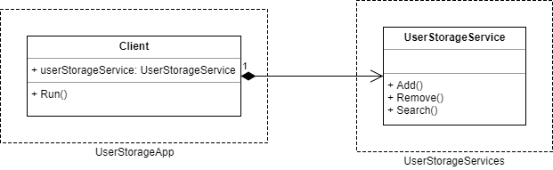


- [ ] [Create a new branch](https://git-scm.com/book/ru/v1/Ветвление-в-Git-Основы-ветвления-и-слияния) with name "step1", and switch to this branch. Make sure that you are on "step1" branch before continue.

```sh
$ git checkout -b step1
$ git branch
  master
* step1
```

- [ ] Add a new _Id_ field to the _User_ class. Use System.Guid as a field type. The field value should uniquely identify a user in the storage. Review changes. Commit changes.

- [ ] Add an internal storage to _UserStorageService_ class. Consider collections from [System.Collections.Generic](https://msdn.microsoft.com/en-us/library/system.collections.generic(v=vs.110).aspx) namespace. A new identifier should be populated and assigned to each new entity before adding it to a collection. Implement Count property getter to return the amount of users in the storage. Review and commit.

- [ ] _UserStorageService_ class contains Add() method that adds a new user to the storage. The method has one guard clause and one validation statement. Tests for the methods of the class are located in _UserStorageServiceTests_ class. Think what more validation rules you can add here. Add tests for those rules, and then write code to implement them.

Test-First: add use cases in form of tests to _UserStorageServiceTests_ class (**red** tests), and only then add implementation to the Add method (make your tests **green**).

Review and commit.

- [ ] Test-First: add use cases (red) and then add an implementation for Remove method (green). Review. Commit.

- [ ] Test-First: add use cases (red) and then add an implementation for Search method (green). Use cases:
  * Search by FirstName.
  * Search by LastName.
  * Search by Age.

Review and commit.

- [ ] Add a new bool field _IsLoggingEnabled_ to _UserStorageService_ class, and add logging functionality to Add method:

```cs
if (IsLoggingEnabled)
{
    Console.WriteLine("Add() method is called.");
}
```

Add logging to Remove and Search methods too. Review and commit.

- [ ] Run StyleCop to make sure the code you have added fits defined code standards. Fix all code issues StyleCop identified. Review and commit.

```sh
$ git status
$ git diff
$ git commit -m "Fix StyleCop issues."
```

- [ ] Mark all completed items in README.md. Review and commit.

- Publish "step1" branch to [remote branch](https://git-scm.com/book/ru/v2/Ветвление-в-Git-Удалённые-ветки) on github.

```sh
$ git push -u origin step2
```

- Switch to master branch. Merge "step1" branch into master. Publish changes to master branch on github.

```sh
$ git checkout master
$ git branch
* master
  step1
$ git merge --squash step1
$ git status
$ git diff --staged
$ git commit -m "Add implementation for Add, Remove and Search methods. Add logging."
$ git log --oneline
$ git status
On branch master
nothing to commit, working directory clean
```


## Step 2 - Extract

The class diagram below shows the application state after all refactorings in the current step.

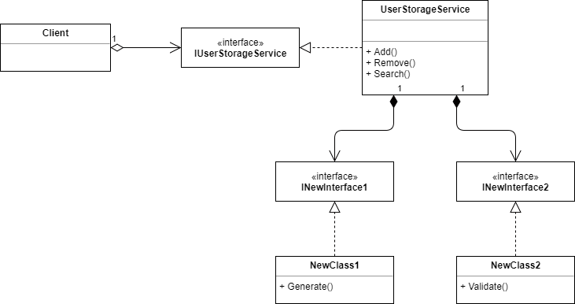

- [ ] Create a new branch with name "step2", and switch to this branch.

_UserStorageService_ is responsible not only for storing user records, but also for generating new identifier and data validation. You will apply [Single Responsibility Principle (SRP)](http://sergeyteplyakov.blogspot.com.by/2014/08/single-responsibility-principle.html) to the service in the next two refactorings.

- [ ] [Extract Class refactoring](https://refactoring.guru/extract-class): extract [strategy](https://refactoring.guru/design-patterns/strategy) of generating new user identifier into a new class.
  * Create a new interface in _UserStorageServices_ project, give it a meaningful name.
  * Test-First: create a new class in _UserStorageServices_ project that implements the interface, and move your code (generation of a new identifier) from _UserStorageService_ class to your new class.
  * Modify _UserStorageService_ to create a new instance of your new class, and use it to generate an identifier when adding a new user.

Run all tests to make sure that _UserStorageService_ works as expected.

Review and commit.

- [ ] Extract Class: extract strategy of validating user data when adding a new user to the storage.
  * Create a new interface in _UserStorageServices_ project, give it a meaningful name.
  * Test-First: create a new class in _UserStorageServices_ project that implements the interface, and move your code (validation of the user data) from _UserStorageService_ class to your new class.
  * Modify _UserStorageService_ to create a new instance of your new class, and use it to validate a user data when adding a new user.

Run all tests to make sure that _UserStorageService_ works as expected.

Review and commit.

- [ ] [Extract Interface](https://refactoring.guru/extract-interface): extract an interface for the UserStorageService class.
  * Create a new interface _IUserStorageService_ in _UserStorageServices_ project, give it a meaningful name.
  * Add all public methods and properties from _UserStorageService_ class to your new interface.
  * Refactor _userStorageService field in _Client_ class: change the field type to your new interface.
  * Refactor constructor in _Client_ class to use [Constructor Injection](http://sergeyteplyakov.blogspot.com.by/2012/12/di-constructor-injection.html) to set _userStorageService_ field.

Run tests, review and commit.

- [ ] Configure logging using App.config.
  * Refactor your _UserStorageService_ class to use [boolean switch](https://msdn.microsoft.com/en-us/library/system.diagnostics.booleanswitch%28v=vs.110%29.aspx) instead of _IsLoggingEnabled_ property.
  * Use _enableLogging_ boolean switch that is already added to your App.config.
  * Remove unnecessary _IsLoggingEnabled_ property.
  * Run application with _enableLogging_ switch enabled and disabled to make sure that logging works properly.

Run tests, review and commit.

- [ ] Run StyleCop. Fix issues. Commit.

- [ ] Mark. Commit.

- Publish "step2" branch to github.

- Switch to master branch. Merge "step2" branch into master. Publish changes to master branch on github.


## Step 3 - Compose and decorate

- [ ] New branch "step3".

- [ ] Composite validator.
  * Refactor your class that validates user data to extract validation logic for each validation rule to a separate class.
  * Use [Composite design pattern](https://refactoring.guru/design-patterns/composite) to create a composite validator.

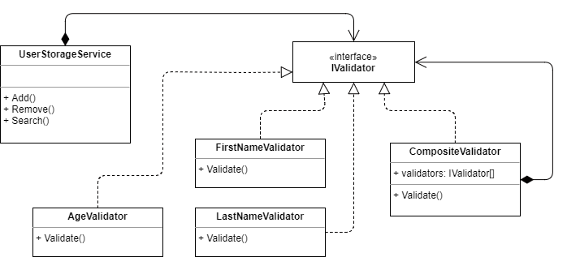

Run tests, review and commit.

- [ ] Validation exceptions. Create a custom exception for each validation case. Examples: FirstNameIsNullOrEmptyException, LastNameExceedsLimitsException, AgeExceedsLimitsException. Each validator rule class should throw its own exception. Modify tests.

Run tests, review and commit.

- [ ] Extended search functionality. Add new functionality to your Search method for supporting these use cases:
  * Search by FirstName and LastName.
  * Search by FirstName and Age.
  * Search by LastName and Age.
  * Search by FirstName, LastName and Age.

Add new tests. Run tests, review and commit.

- [ ] Extract logging functionality.
  * Extract Class: extract logging functionality to a separate class that inherits _IUserStorageService_ interface.
  * Use [Decorator design pattern](https://refactoring.guru/design-patterns/decorator) to create a log decorator.
  * Make _UserStorageServiceDecorator_ class abstract.
  * Modify your application code to create a new log decorator and pass it to the _Client_ class instead of _UserStorageService_ class.

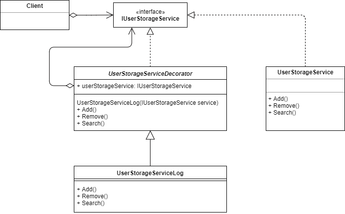

Run tests, review and commit.

- [ ] Refactor _UserStorageServiceLog_ to use [Trace Listeners](https://docs.microsoft.com/en-us/dotnet/framework/debug-trace-profile/trace-listeners) to log all _UserStorageService_ method calls.
  * Configure [TextWriterTraceListener](https://docs.microsoft.com/en-us/dotnet/api/system.diagnostics.textwritertracelistener) [by using a configuration file](https://docs.microsoft.com/en-us/dotnet/framework/debug-trace-profile/how-to-create-and-initialize-trace-listeners).
  * Replace Console.WriteLine method calls with appropriate Debug or Trace methods.
  * Add more listeners to the App.config to support console, XML and CSV output.
  * Comment CSV and XML listeners before commit.

Run tests, review and commit.

- [ ] Run StyleCop, fix issues, commit. Mark, commit. Publish "step3". Merge "step3" into master. Publish.


## Step 4 - Master-Slave

- [ ] New branch "step4".

- [ ] Test-First: make _UserStorageService_ work in two modes - MASTER AND SLAVE NODE.
  * Add a new _UserStorageServiceMode_ enum with two values - _MasterNode_ and _SlaveNode_.
  * Extend _UserStorageService_ class constructor with new parameters - _UserStorageServiceMode_ and _IEnumerable\<IUserStorageService\>_.
  * If the service works as the _MasterNode_ it should allow Add, Remove and Search method calls.
  * If the service works as the _SlaveNode_ it should allow only Search method call. When Add or Remove is called the service should throw [NotSupportedException](https://msdn.microsoft.com/en-us/library/system.notsupportedexception(v=vs.110).aspx).
  * If the service works as the _MasterNode_ it should make a call for Add and Remove method to all dependent SLAVE NODES with the same parameters.

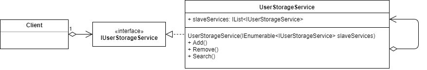

The [sequence diagram](http://www.uml-diagrams.org/sequence-diagrams.html) below shows how MASTER NODE communicates with SLAVE NODES when the Add method is called:

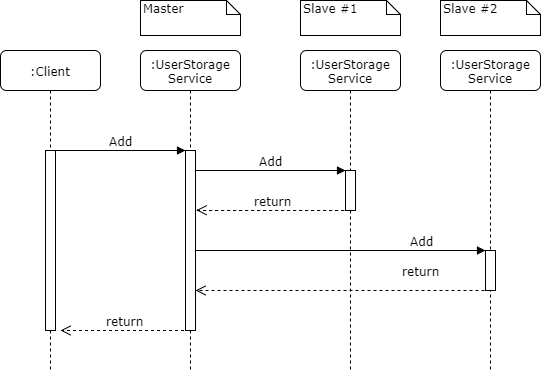

Add new tests first, then add implementation to _UserStorageService_. Run tests, review and commit.

- [ ] Change the code of your application to have the MASTER NODE that is connected with two SLAVE NODES.

- [ ] Add a new interface _INotificationSubscriber_ and implement [Observer design pattern](https://refactoring.guru/design-patterns/observer) as shown on the class diagram below:

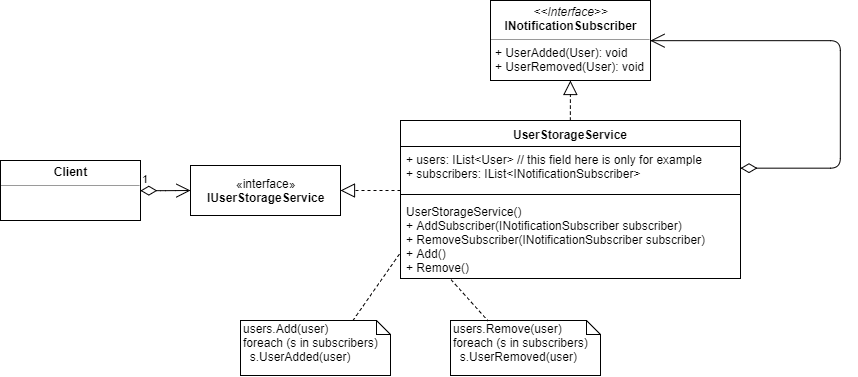

Run tests, review and commit.

- [ ] [Replace Conditional with Polymorphism](https://refactoring.guru/replace-conditional-with-polymorphism) for _UserStorageService_ class. Use [generalization-related refactorings](https://refactoring.guru/refactoring/techniques/dealing-with-generalization) to do that.
  * Rename _UserStorageService_ class to _UserStorageServiceBase_ class, and make it abstract.
  * Create two derived classes - _UserStorageServiceMaster_ and _UserStorageServiceSlave_.
  * Move code behavior that is specific to MASTER NODE to _UserStorageServiceMaster_ class.
  * Move code behavior that is specific to SLAVE NODE to _UserStorageServiceSlave_ class.
  * Add a new property _ServiceMode_ to _IUserStorageService_ interface with _UserStorageServiceMode_ type, and implement it in both derived classes.
  * Refactor your code according to the class diagram below:

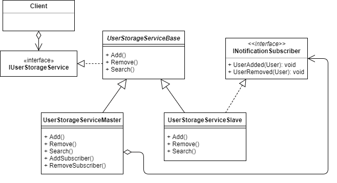

Run tests, review and commit.

- [ ] Replace Observer design pattern with [C# events](https://msdn.microsoft.com/en-us/library/ee817669.aspx#observerpattern_topic3b). Use [C# Event Implementation Fundamentals, Best Practices and Conventions](https://www.codeproject.com/Articles/20550/C-Event-Implementation-Fundamentals-Best-Practices) article to avoid the common mistakes when implementing that task.

Refactor tests, run tests, review and commit.

- [ ] Run StyleCop, fix issues, commit. Mark, commit. Publish "step4". Merge "step4" into master. Publish.


## Step 5 - Persistence

- [ ] New branch "step5".

- [ ] Test-First: create a new interface _IUserRepository_ and two new classes:

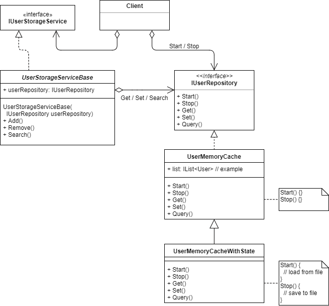

There's an inconsistency in the diagram above - the _IUserRepository_ interface has three methods Get, Set, and Query. Add also Delete method in this interface.

Run tests, review and commit.

- [ ] Refactor your code.
  * [Extract Method](https://refactoring.guru/extract-method): extract all code in _UserStorageService_ class that access an internal user collection to private method with Get, Set and Query method names.
  * [Move Field](https://refactoring.guru/move-field): move a user collection from _UserStorageServiceBase_ to _UserMemoryCache_ class.
  * [Move Method](https://refactoring.guru/move-method): move your new private Get, Set and Query methods to _UserMemoryCache_ class, and make them public.

Add new tests, run all tests, review and commit.

- [ ] Modify _UserMemoryCacheWithState_:
  * Stop() should save repository state to the disk file.
  * Start() should load respository state from the disk file.
  * Client should call Start() method before making any calls to _IUserStorageService_ to load the repository state.
  * Client should call Stop() method after all calls to _IUserStorageService_ to save the repository state.
  * Use "repository.bin" as a file name.
  * Use [BinaryFormatter](https://msdn.microsoft.com/en-us/library/system.runtime.serialization.formatters.binary.binaryformatter(v=vs.110).aspx) to save the repository user data in binary format (binary serialization).

Add new integration tests ([save to a file, load from a file](https://stackoverflow.com/questions/20265369/how-to-do-integration-testing-in-net-with-real-files)).

Run all tests, review and commit.

- [ ] Use [ConfigurationManager.AppSettings](https://msdn.microsoft.com/en-us/library/system.configuration.configurationmanager.appsettings(v=vs.110).aspx) to store a name of repository user data file. Use the setting value to configure _UserMemoryCacheWithState_ class from the outside.

Run tests, review and commit.

- [ ] Strategy: extract serialization functionality as a strategy, and a new strategy to support [XML serialization using XmlSerializer](https://docs.microsoft.com/en-us/dotnet/csharp/programming-guide/concepts/linq/how-to-serialize-using-xmlserializer).

Add new tests, run all tests, review and commit.

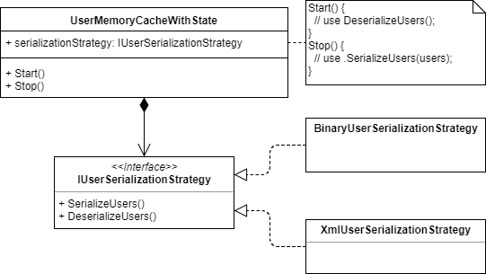

- [ ] Give your own meaningful names to _UserMemoryCache_ and _UserMemoryCacheWithState_ classes.

Refactor, run tests, review and commit.

- [ ] Add implementation that will allow UserStorage services save the last generated identifier to continue generating after shutdown.

Refactor, run tests, review and commit.

- [ ] Run StyleCop, fix issues, commit. Mark, commit. Publish "step5". Merge "step5" into master. Publish.


## Step 6 - Refactor

- [ ] New branch "step6".

- [ ] Refactor files in _UserStorageServices_ project: move interfaces and classes related to repository functionality to a separate folder.

Run tests, review and commit.

- [ ] Refactor files in _UserStorageServices_ project: move interfaces and classes related to user storage functionality to a separate folder.

Run tests, review and commit.

- [ ] Apply ["interface segregation principle" (ISP)](http://sergeyteplyakov.blogspot.com.by/2014/08/interface-segregation-principle.html):

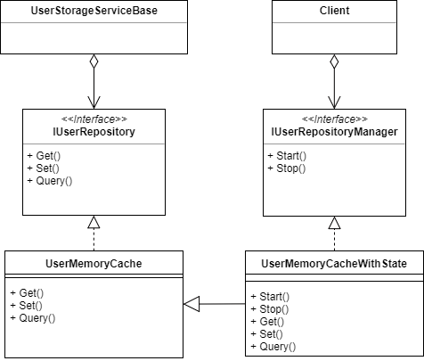

Modify tests, run tests, review and commit.

- [ ] Run StyleCop, fix issues, commit. Mark, commit. Publish "step6". Merge "step6" into master. Publish.


## Step 7 - Notify

- [ ] New branch "step7".

- [ ] Add [code from this gist](https://gist.github.com/epam-lab/1afc6a58e5be16cc4282a1b98728a4c2) to your project.

Run tests, review and commit.

- [ ] Add new implementation and refactor existed functionality:


Add new tests, run tests, review and commit.

- [ ] Refactor you code: serialize _NotificationContainer_ to XML and pass it to receiver as a string.


Modify tests, run tests, review and commit.

- [ ] Composite design pattern: create a composite notification sender to allow MASTER NODE to send notifications to a variable amount of receivers.


Add new tests, run tests, review and commit.

- [ ] Run StyleCop, fix issues, commit. Mark, commit. Publish "step7". Merge "step7" into master. Publish.


## Step 8 - Application Domains

- [ ] New branch "step8".

- [ ] Refactor infrastructure code: each instance of the user storage service class should be activated in a separate AppDomain. Each MASTER and SLAVE NODE should be created in separate application domain.

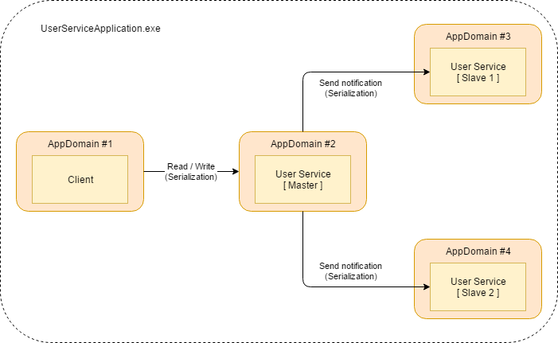

- [ ] Run StyleCop, fix issues, commit. Mark, commit. Publish "step8". Merge "step8" into master. Publish.


## Step 9 - Configure

- [ ] New branch "step9".

- [ ] Use an application configuration file to setup services configuration.
  * There is a [custom configuration sections](https://habrahabr.ru/post/128517/) in App.config that has "serviceConfiguration" name. Use ConfigurationManager.GetSection method to get configuration as an object.
  * There is no support for network communication. Ignore host and port settings.
  * Hardcode any custom behavior (if name=="master-us" or if type="UserStorageMaster") if necessary.

```cs
var serviceConfiguration = (ServiceConfiguration)System.Configuration.ConfigurationManager.GetSection("serviceConfiguration");
```

- [ ] Run StyleCop, fix issues, commit. Mark, commit. Publish "step9". Merge "step9" into master. Publish.


## Step 10 - Reflect

- [ ] New branch "step10".

- [ ] Refactor validation: create [new attribute classes](https://docs.microsoft.com/en-us/dotnet/standard/design-guidelines/attributes) and [use reflection](https://docs.microsoft.com/en-us/dotnet/csharp/programming-guide/concepts/attributes/accessing-attributes-by-using-reflection) to validate input from the client like in this example:

```cs
class User
{
    [ValidateMaxLength(20)]
    [ValidateNotNullOrEmpty]
    [ValidateRegex("([A-Za-z])\w+")]
    public string FirstName { get; set; }

    [ValidateMaxLength(25)]
    [ValidateNotNullOrEmpty]
    [ValidateRegex("([A-Za-z])\w+")]
    public string LastName { get; set; }

    [ValidateMinMax(18, 110)]
    public int Age { get; set; }
}
```

Refactor existed tests and add new test, run tests, commit.

- [ ] Create a new attribute and apply it to MASTER NODE and SLAVE NODE classes.

```cs
[MyApplicationService("UserStorageMaster")]
class UserStorageServiceMaster
{}

[MyApplicationService("UserStorageSlave")]
class UserStorageServiceSlave
{}
```

Run tests, review, commit.

- [ ] When creating a new service instances use this attributes to find a service type in _UserStorageServices_ assembly that matches a value of the _type_ attribute in _serviceInstance_ node in App.config. Use [Activator class](https://msdn.microsoft.com/en-us/library/system.activator(v=vs.110).aspx) to create a new service instance. Hardcode is allowed here.

- [ ] Run StyleCop, fix issues, commit. Mark, commit. Publish "step10". Merge "step10" into master. Publish.


## Step 11 - Synchronize

- [ ] New branch "step11".

- [ ] The collection in your repository is going to be used in multi-threading environment, and this may lead to concurrency issues. Make your repository thread-safe using [lock statement](https://docs.microsoft.com/en-us/dotnet/csharp/language-reference/keywords/lock-statement).

Run tests, review and commit.

- [ ] Make your repository thread-safe using [ReaderWriterLockSlim class](https://docs.microsoft.com/en-us/dotnet/standard/threading/reader-writer-locks).

Run tests, review and commit.

- [ ] Run StyleCop, fix issues, commit. Mark, commit. Publish "step11". Merge "step11" into master. Publish.


## Step 12 - WCF

The diagram below shows the expected application architecture:

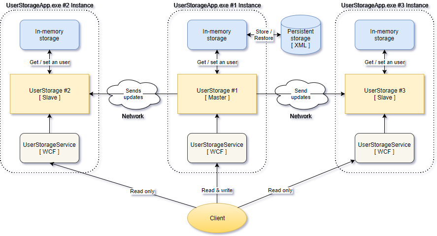

- [ ] New branch "step12".

- [ ] Design and implement a new WCF service to allow other applications access service endpoints to work UserStorage services. Each UserStorage service should have its own WCF service for handling incoming requests. Use _apiPort_ service parameter in App.config and "http://localhost:apiPort/userStorage" template for WCF service endpoint. You can use [DiagnosticsService](UserStorage/UserStorage.Diagnostics/DiagnosticsService.cs) as an example, just notice that DiagnosticsService works as a [singleton](https://msdn.microsoft.com/en-us/library/system.servicemodel.instancecontextmode(v=vs.110).aspx) and configured using App.config file.

Run tests, review, commit.

- [ ] Create a new console application and connect to WCF services for MASTER and SLAVE NODES. You can use [UserStorageMonitor](UserStorage/UserStorageMonitor) as an example.

Run tests, review, commit.

- [ ] Implement [MyDiagnostics](UserStorage/UserStorageApp/MyDiagnostics.cs) service to show actual status of all loaded services online.

Run tests, review, commit.

- [ ] Run StyleCop, fix issues, commit. Mark, commit. Publish "step12". Merge "step12" into master. Publish.


## Step 13 - Network

- [ ] New branch "step13".

- [ ] Replace functionality of notification receivers and senders to allow them to communicate over the network using TCP protocol:
  * For MASTER NODE - send update notifications to all registered SLAVE NODE endpoints.
  * For SLAVE NODE - listen to endpoint and receive update notifications from MASTER NODE.
  * Note: Use [NetworkStream](https://msdn.microsoft.com/ru-ru/library/system.net.sockets.networkstream%28v=vs.110%29.aspx), [TcpClient](https://msdn.microsoft.com/ru-ru/library/system.net.sockets.tcpclient(v=vs.110).aspx) and [TcpListener](https://msdn.microsoft.com/ru-ru/library/system.net.sockets.tcplistener(v=vs.110).aspx) or [Socket](https://msdn.microsoft.com/ru-ru/library/system.net.sockets.socket(v=vs.110).aspx) to establish communication channel between nodes.

- [ ] Use host and port settings from an application config to setup notification senders and receivers for all services.

- [ ] Run StyleCop, fix issues, commit. Mark, commit. Publish "step13". Merge "step13" into master. Publish.


## Step 14 - Checkpoint

- [ ] New branch "step14".

- [ ] Remove any hardcode that was added on the previous steps.

- [ ] Review the project codebase with criteria that are mentioned in presentation ["Writing High Quality Code in C#"](https://www.slideshare.net/nakov/writing-high-quality-code-in-c). Fix and refactor if necessary.

- [ ] Run StyleCop, fix issues, commit. Mark, commit. Publish "step14". Merge "step14" into master. Publish.


## Step 15 - Cache

- [ ] New branch "step15".

- [ ] Apply Decorator design pattern to repository:


Run tests, review, commit.

- [ ] Implement _UserRepositoryDelayer_ - this class should wait for a timeout before calling the next repository in the decorator chain. The goal of this class is to emulate slow storage.

Run tests, review, commit.

- [ ] Implement _UserRepositoryCache_ using [MemoryCache](https://habrahabr.ru/company/infopulse/blog/258247/) class. This class should store a user object in a cache before it will expire (use expirationInterval).

Run tests, review, commit.

- [ ] Create a chain of decorators: UserRepositoryCache->UserRepositoryDelayer->UserRepositoryCache(WithState). Test the cache behavior.

Run tests, review, commit.

- [ ] Run StyleCop, fix issues, commit. Mark, commit. Publish "step15". Merge "step15" into master. Publish.